# Lavelle Tech Platform — Complete Technical Documentation

**Documentation Generated:** September 3, 2026  
**Application Version:** Current HEAD (commit: 654c82a)  
**Last Reviewed:** September 3, 2026

---

## IMPORTANT

This documentation describes the Lavelle Tech Platform codebase as it existed at the documented commit. Always verify implementation details against the source code before making major changes. The system is production-deployed on Vercel with a PostgreSQL database managed via Prisma ORM.

---

## What is Lavelle?

Lavelle is a comprehensive **legal education platform** that enables:
- Law professionals to enroll in structured, industry-relevant courses
- Lecturers/faculty to author and deliver course content
- Admin staff to manage candidates, payments, assessments, and certifications
- Public discovery and enrollment in programmes
- Online exams with proctor monitoring
- Digital certificates with public verification

The platform serves three primary user types:
1. **Candidates** - Law professionals taking courses
2. **Staff** - Faculty, admins, finance, support teams
3. **Public** - Marketing site visitors discovering programmes

---

## Technology Stack

| Layer | Technology |
|-------|-----------|
| **Framework** | Next.js 16.3.0 (App Router, React 19) |
| **Language** | TypeScript (strict mode) |
| **Database** | PostgreSQL + Prisma ORM 7.9.1 |
| **Authentication** | Database-backed sessions (custom, not JWT) |
| **Styling** | Tailwind CSS 4 |
| **Validation** | Zod 4.4.3 |
| **Email** | Nodemailer 9.0.5 (Brevo/SMTP) |
| **Video** | Cloudinary 2.10.1 |
| **Payments** | Nomba (primary), Paystack (configured) |
| **PDF** | pdf-lib 1.17.1 (certificates, admission slips) |
| **Error Tracking** | Sentry 10.70.0 |
| **Storage** | Cloudinary (media), PostgreSQL (data) |
| **Deployment** | Vercel (Next.js hosting, Postgres adapter) |

---

## Application Structure

```
/src
├── /app
│   ├── /(auth)              # Public auth pages (register, sign-in)
│   ├── /admin               # Staff portal (admin shell + routes)
│   ├── /portal              # Candidate portal (candidate shell + routes)
│   ├── /api                 # Route handlers (webhooks, uploads, etc.)
│   ├── /actions             # Server Actions (auth, payments, etc.)
│   ├── /programmes          # Public programme pages
│   ├── /verify              # Public certificate verification
│   ├── /blog                # Public blog pages
│   ├── /contact             # Public contact page
│   ├── /checkout            # Payment/enrollment flow
│   ├── /sitting             # Exam sitting interface
│   ├── /pay                 # Payment return pages
│   ├── layout.tsx           # Root layout
│   └── page.tsx             # Marketing homepage
├── /components
│   ├── /ui                  # Reusable UI components
│   ├── /admin               # Admin-specific components
│   ├── /portal              # Candidate portal components
│   ├── /auth                # Auth form components
│   ├── /shell               # Layout shells
│   └── /site                # Public website components
├── /lib
│   ├── candidate-auth.ts    # Candidate auth business logic
│   ├── staff-auth.ts        # Staff auth business logic
│   ├── candidate-session.ts # Candidate session management
│   ├── staff-session.ts     # Staff session management
│   ├── rbac.ts              # Role-based access control
│   ├── permissions.ts       # Permission definitions
│   ├── candidate-reads.ts   # Candidate data queries
│   ├── admin-reads.ts       # Admin queries
│   ├── website-reads.ts     # Public website queries
│   ├── and 100+ other domain logic files
├── /hooks                   # React custom hooks
├── /generated               # Prisma client (auto-generated)
└── middleware.ts            # Request middleware

/prisma
├── schema.prisma            # Complete data model (67 models)
└── seed.ts                  # Database seeding
```

---

## Main User Types & Flows

### Candidate Journey
```
Registration (Email OTP)
    ↓
Profile Completion
    ↓
Browse Programmes (Catalogue)
    ↓
Enroll (Payment via Nomba)
    ↓
Learn (Watch modules, complete steps, write drafts, take quizzes)
    ↓
Assessments (Drafting submission → Faculty marking)
    ↓
Exams (Register → Sitting → Proctoring → Results)
    ↓
Certificates (Issue → Download → Public Verification)
```

### Staff (Admin) Journey
```
Invitation (Email with activation token)
    ↓
Set Password / Activate
    ↓
Access Dashboard (Role-based navigation)
    ↓
Manage Programmes, Candidates, Payments, Exams, Certificates
```

### Public User Journey
```
Visit Marketing Site
    ↓
Browse Programmes / Blog / FAQ
    ↓
Submit Contact Form (Creates anonymous SupportRequest)
    ↓
Optional: Verify Certificate (Public endpoint)
```

---

## Major Modules

| Module | Purpose | Key Files |
|--------|---------|-----------|
| **Authentication** | Candidate & staff sign-up, sign-in, password reset | `/src/lib/candidate-auth.ts`, `/src/lib/staff-auth.ts` |
| **Programmes** | Course authoring, publishing, categorization | `/src/lib/programme-*.ts` (7 files) |
| **Enrollment** | Payment collection, candidate enrollment lifecycle | `/src/lib/enrolment.ts`, `/src/lib/payment*.ts` |
| **Learning** | Course module delivery, lecture player, progress tracking | `/src/lib/lecture*.ts`, `/src/lib/progress.ts` |
| **Assessment** | Drafting submission, faculty marking, grading | `/src/lib/marking*.ts`, `/src/lib/rubric*.ts` |
| **Exams** | Exam builder, sitting management, proctoring, results | `/src/lib/exam*.ts` (8 files), `/src/lib/sitting*.ts` |
| **Certificates** | Certificate template design, issuance, revocation, public verification | `/src/lib/certificate*.ts` (5 files) |
| **Support** | Support desk, ticket assignment, messaging | `/src/lib/support*.ts` (3 files) |
| **Announcements** | Scheduled notifications (in-app, email, WhatsApp, SMS) | `/src/lib/announcement*.ts` (3 files) |
| **Analytics** | Staff performance, candidate progress, financial reports | `/src/lib/analytics*.ts` (5 files) |
| **Admin** | Staff management, permissions, audit logging | `/src/lib/admin*.ts` (3 files) |

---

## Architecture Overview

```mermaid
graph TB
    subgraph "Public"
        WEB["Public Website<br/>(Marketing, Blog, FAQ, Contact)"]
        VERIFY["Certificate Verification"]
    end
    
    subgraph "Candidate Portal"
        CAND_AUTH["Registration & Auth"]
        CAND_DASH["Dashboard & Profile"]
        CATALOGUE["Programme Catalogue"]
        LEARN["Course Player<br/>(Lectures, Quizzes, Drafts)"]
        EXAM["Exam Sitting & Registration"]
        CRED["Credentials & Certificates"]
    end
    
    subgraph "Admin Portal"
        ADMIN_AUTH["Staff Auth & Invitations"]
        ADMIN_DASH["Admin Dashboard"]
        PROG_MGMT["Programme Management"]
        CAND_MGMT["Candidate Management"]
        MARK["Marking Queue"]
        EXAM_ADMIN["Exam Management"]
        CERT_ADMIN["Certificate Templates"]
        FINANCE["Payment & Finance Ledger"]
        SUPPORT["Support Desk"]
        STAFF_MGMT["Staff & Permissions"]
        AUDIT["Audit Log"]
    end
    
    subgraph "Backend"
        API["API Routes & Server Actions"]
        WEBHOOKS["Webhooks<br/>(Nomba, Paystack, Cloudinary)"]
        JOBS["Cron Jobs<br/>(Announcements, Exam Expiry)"]
        LOGIC["Business Logic Layer<br/>(67 database operations)"]
    end
    
    subgraph "Integrations"
        NOMBA["Nomba Payments<br/>(OAuth2)"]
        EMAIL["Brevo Email<br/>(SMTP)"]
        CLOUDINARY["Cloudinary Media<br/>(Presigned URLs)"]
        SENTRY["Sentry Monitoring"]
    end
    
    subgraph "Storage"
        DB["PostgreSQL<br/>(67 models)"]
    end
    
    WEB --> API
    VERIFY --> API
    CAND_AUTH --> API
    CAND_DASH --> API
    CATALOGUE --> API
    LEARN --> API
    EXAM --> API
    CRED --> API
    ADMIN_AUTH --> API
    ADMIN_DASH --> API
    PROG_MGMT --> API
    CAND_MGMT --> API
    MARK --> API
    EXAM_ADMIN --> API
    CERT_ADMIN --> API
    FINANCE --> API
    SUPPORT --> API
    STAFF_MGMT --> API
    AUDIT --> API
    
    API --> LOGIC
    WEBHOOKS --> LOGIC
    JOBS --> LOGIC
    
    LOGIC --> DB
    
    NOMBA -.->|Webhook| WEBHOOKS
    EMAIL -.->|SMTP| LOGIC
    CLOUDINARY -.->|API| LOGIC
    LOGIC -.->|Events| SENTRY
```



---

## Key Technical Decisions

### Session Management (Not JWT)
- Database-backed sessions stored in `Session` table
- Separate session tables for candidates and staff (isolation)
- 24-hour absolute expiry (never extended)
- Synchronous revocation on: suspension, deactivation, password change, logout
- Uses HMAC-SHA256 token hashing

### Authentication Approach
- Email-based sign-up with OTP verification
- Password reset via OTP code (not link-only)
- Staff password set via invitation token
- Optional: Staff can sign in via OTP (no password required)
- All sessions revoked when account suspended or staff deactivated

### Database Architecture
- Polymorph tables (one model serving multiple entity types)
  - `Session` stores candidate OR staff sessions (XOR constraint)
  - `Notification` serves both user types
  - `Mark` stores drafting OR exam marks
- Immutable history (certificates never edited, only superseded)
- Append-only audit log (DB role has INSERT/SELECT only)
- Derived-on-read (progress %, deadline states computed, never stored)
- Snapshots (grade bands, assessment weights stored at result issuance)

### API Pattern
- Server Actions for mutations (forms, state changes)
- Route handlers for webhooks and file serving
- No REST-style endpoints (Next.js App Router conventions)
- Presigned URLs for direct media uploads (bypasses server I/O)

### Authorization Model
- Role-based access (8 roles: SUPER_ADMIN, REGISTRAR, ACADEMIC_ADMIN, etc.)
- Granular permission grants (17 permissions stored as `StaffPermission` rows)
- SUPER_ADMIN explicitly holds all 17 permissions (not a bypass flag)
- Permission checks via database row presence

### Email Pattern
- Transactional email via Nodemailer + Brevo SMTP
- Never blocks webhook responses (queued async)
- Email audit trail in `EmailLog` table
- Multi-channel announcements (in-app, email, WhatsApp, SMS) with per-recipient tracking

### Payment Integration
- Webhook-first design (Nomba sends payment notifications)
- Idempotent webhook handling via `WebhookEvent` deduplication
- HMAC-SHA256 signature verification
- Fallback: Manual offline payment recording by finance staff
- Presigned URLs for all sensitive redirects

---

## Documentation Files

| File | Contents |
|------|----------|
| **[ARCHITECTURE.md](ARCHITECTURE.md)** | Framework, request flows, server/client components, middleware, background jobs |
| **[CODEBASE.md](CODEBASE.md)** | Repository structure, conventions, entry points, utilities, error handling |
| **[DATABASE.md](DATABASE.md)** | 67 database models, relationships, enums, schema details, ER diagram |
| **[API.md](API.md)** | All endpoints (webhooks, uploads, exams, marking, cron jobs, etc.) with params/responses |
| **[AUTHENTICATION.md](AUTHENTICATION.md)** | Session management, password handling, OTP flows, RBAC, permission system |
| **[FEATURES.md](FEATURES.md)** | User journeys, business rules, edge cases for each major feature |
| **[ADMIN_PORTAL.md](ADMIN_PORTAL.md)** | Staff workflows, programme management, candidate records, payments, certificates |
| **[CANDIDATE_PORTAL.md](CANDIDATE_PORTAL.md)** | Registration to certificate lifecycle, learning, exams, assessments |
| **[WEBSITE.md](WEBSITE.md)** | Public pages, animations, forms, programme discovery, contact flow |
| **[COMPONENTS.md](COMPONENTS.md)** | Reusable UI component catalogue with props and usage patterns |
| **[DEPLOYMENT.md](DEPLOYMENT.md)** | Vercel hosting, environment setup, migrations, builds, webhooks |
| **[ENVIRONMENT.md](ENVIRONMENT.md)** | All environment variables with purposes (no secrets exposed) |
| **[INTEGRATIONS.md](INTEGRATIONS.md)** | Nomba, Paystack, Brevo, Cloudinary, Sentry with auth methods and flows |
| **[BUSINESS_LOGIC.md](BUSINESS_LOGIC.md)** | Eligibility rules, enrollment conditions, payment flows, exam rules |
| **[TROUBLESHOOTING.md](TROUBLESHOOTING.md)** | Known issues, error handling patterns, debugging tips |

---

## Local Development

### Prerequisites
```bash
Node.js 20+
PostgreSQL 14+
npm or yarn
```

### Setup
```bash
# Install dependencies
npm install

# Configure environment (.env.local)
cp .env.example .env.local
# Edit .env.local with your database and service credentials

# Create and seed database
npm run db:push
npm run db:seed

# Start dev server
npm run dev
# Open http://localhost:3000
```

### Key Commands
```bash
npm run dev              # Development server
npm run build            # Production build
npm run start            # Production start
npm test                 # Run all tests (Vitest)
npm run test:watch       # Watch mode
npm run db:push          # Apply schema changes
npm run db:studio        # Prisma Studio (web interface)
npm run db:seed          # Seed test data
npm run lint             # TypeScript + ESLint
```

### Database
- Local: PostgreSQL running locally or via Docker (`docker-compose up`)
- Staging: Vercel Postgres (connection string in `.env`)
- Production: Vercel Postgres (connection string in `.env`)

### Testing
- Unit/integration tests: Vitest in `/tests` directory
- Test database: Separate test instance (see vitest.config.mts)
- Coverage: 217/232 tests passing (payment provider stubs account for failures)

---

## Deployment

### Platforms
- **Hosting:** Vercel (Next.js)
- **Database:** Vercel Postgres or AWS RDS (Prisma Postgres adapter)
- **Media:** Cloudinary (video, images, documents)
- **Email:** Brevo SMTP
- **Monitoring:** Sentry

### Build & Deploy
1. Push to `develop` branch
2. Vercel automatically builds and deploys to staging
3. Merge to `main` branch for production deployment
4. Prisma migrations run automatically during build

### Environment Management
- `.env.local` - Local development
- `.env.production` - Production secrets
- Vercel dashboard - Staging/production env vars

See **[DEPLOYMENT.md](DEPLOYMENT.md)** for detailed setup and troubleshooting.

---

## Important Things to Know Before Modifying

### 1. Database Schema Changes
- Edit `/prisma/schema.prisma`
- Run `npm run db:push` to migrate locally
- Changes are applied automatically on Vercel deployment
- Never manually delete migrations

### 2. Authentication is Custom
- Not using NextAuth for candidates or staff
- Sessions stored in database (not signed JWT tokens)
- Every session revocation checks database (synchronous)
- Do not switch back to JWT without major refactoring

### 3. Permissions are Granular
- Check `StaffPermission` table for actual grants (not role-based)
- SUPER_ADMIN has no special bypass; they hold all 17 permissions as rows
- Always use `requireStaffPermission(Permission.X)` in admin actions

### 4. Email is Asynchronous
- Never expect email in response paths (transactional only)
- Email failures are logged but don't block operations
- Test email delivery via `POST /api/test/test-all-emails`

### 5. Payments Use Webhooks
- Payment status determined by Nomba webhook, not user redirect
- Webhook idempotency handled via `WebhookEvent` deduplication key
- Offline payments allow manual recording by finance staff

### 6. Progress is Computed, Not Stored
- Deadline states, module completion %, progress rings all computed on read
- Derived from: `LectureProgress`, `DraftingSubmission`, `QuizAttempt`, `Sitting` records
- Never try to UPDATE progress—it's a derived view

### 7. Certificate Numbers are Permanent
- Once issued, certificate number never changes
- Revoked certificates create new SUPERSEDED certificate
- Public verification keyed by certificate number (immutable)

### 8. Audit Log is Append-Only
- Database role for audit table is INSERT/SELECT only (no UPDATE/DELETE)
- Use for compliance and debugging
- Every sensitive action must record an `AuditEvent`

---

## Common Questions

**Q: How do I add a new permission?**  
A: Add to `Permission` enum in `/prisma/schema.prisma`, then add to `PERMISSIONS` array and `SUPER_ADMIN` preset in `/src/lib/permissions.ts`. Migration runs automatically.

**Q: How do candidates know their password?**  
A: Candidates set it during registration after email OTP verification. Staff never sets candidate passwords.

**Q: Can a candidate re-sit an exam?**  
A: Yes, if `Exam.attemptPolicy` allows (ONE_ATTEMPT, TWO_ATTEMPTS, or ONE_RESIT_ON_REFERRAL). Re-sit eligibility is checked before registration.

**Q: What triggers certificate issuance?**  
A: When candidate's `ProgrammeResult` is computed and graded as PASS or REFER (depending on certificate criteria).

**Q: Can courses have multiple instructors?**  
A: Yes, `Lecture` has optional `authorName` field. Multiple lectures can have different authors. Programme author is optional.

**Q: How are deadlines enforced?**  
A: Computed on read from `Deadline` table, which itself is derived from `Enrolment` + module release schedule + suspension history. No server-side enforcement; UI prevents submission after deadline.

---

## Next Steps for New Developers

1. **Read** → Start with this file and **[ARCHITECTURE.md](ARCHITECTURE.md)**
2. **Explore** → Open **[DATABASE.md](DATABASE.md)** to understand data model
3. **Understand** → Pick a feature in **[FEATURES.md](FEATURES.md)** and trace through code
4. **Navigate** → Use **[CODEBASE.md](CODEBASE.md)** to find files
5. **Debug** → Check **[TROUBLESHOOTING.md](TROUBLESHOOTING.md)** for common issues
6. **Build** → Use **[API.md](API.md)** and **[COMPONENTS.md](COMPONENTS.md)** as references

---

## Contact & Support

- **Application Owner:** Tega Odia (praise1564@gmail.com)
- **Production Site:** https://lavelle.com (deployed)
- **Staging/Preview:** Branch deployments via Vercel
- **Issue Tracking:** GitHub repository

---

**Last Updated:** September 3, 2026  
**Commit:** 654c82a (fix: remove empty draftSeeds loop causing TypeScript errors)
